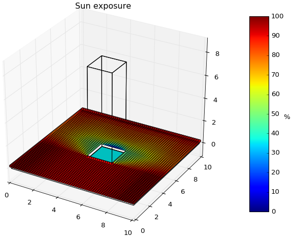

README
======

.. contents::
    :local:

Abstract
--------
*pyny3d* is a Python3 *tyny* 3D tool for build and generate information from
simple and light geometry models based on polygons. Furthermore, it is possible
to perform solar shadowing simulations and timeseries data projections 
(radiation, for example) over them. The whole library can be used interactively
or coded autonomously or alongside with other codes.

It is built on top of numpy, scipy, matplotlib and shapely. It uses two 
well-known 2D geometry objects (`matplotlib.Path.path` and 
`shapely.geometry.Polygon`) to safely compute a wide range of planar operations
at reasonable speed, without the need for the user to worry about the low-level
 workflow.

It has been designed to be a tool for scientific and engineering applications.
It could hardly be useful in other areas such as computer graphics.

Hello World Code Snippet
------------------------
Very simple example using some basic funtionalities:

.. code:: python

    import numpy as np
    import pyny3d.geoms as pyny

    # Geometry creation
    ## Polygons by their vertices
    base = np.array([[0,0], [10,0], [10,10], [0,10]]) # Base square on the floor
    pillar = np.array([[4,4,8], [6,4,8], [6,6,8], [4,6,8]]) # Top obtacle polygon (to extrude)
    ## Obstacle
    place = pyny.Place(base)
    place.add_extruded_obstacles(pillar)
    space = pyny.Space(place)

    # Shadows
    S = space.shadows(init='auto', resolution='high')

    # Viz
    S.viz.exposure_plot()

Miscelaneous
------------
Disclaimer
~~~~~~~~~~
`pyny3d` is developing in a educational and reseach environment by 
civil engineers in order to create a **very easy to use and intuitive**
library. For these reason, I do not recommend to use it in applications
where geometries could be very complex or if the performance is a determinant 
factor.

On the other hand, it is actually a great tool for prototype more general
purpose programs, working inside them to automate operations on 3D geometries
(like translations, rotations, arbitrary projections, shading...) and then 
return this information back.

Requirements
~~~~~~~~~~~~
* Python >=3.x
* Shapely >=1.5.x <https://pypi.python.org/pypi/Shapely>
* matplotlib >=1.5.x <http://matplotlib.org/faq/installing_faq.html#installation>
* scipy >=0.17.x <http://www.scipy.org/install.html>
* numpy >=1.10.x <http://www.scipy.org/install.html>

Installing pyny3d
~~~~~~~~~~~~~~~~~
Use the pip install way: ``\$ pip install pyny3d``
   
Roadmap and Maintenance
~~~~~~~~~~~~~~~~~~~~~~~
`pyny3d` is far from be the full-featured and optimized library I expect. 
Releasing v0.1 allows me to start receiving feedback from users and will help
me to continue developing better and faster.

On the other hand, I want to advice that the inclusion of non-straight lines
or non-planar surfaces are not expected. In the same way, all the computations
will be guaranteed only for convex polygons and bodies.

Upcoming improvements
~~~~~~~~~~~~~~~~~~~~~

    * Space.stretch method.
    * Computes volumes and areas.
    * Extrude polyhedra on arbitrary directions.
    * Extrude a single polyhedra besides the projection intersects multiple
      polygons.
    * zrotate -> rotate(ang, axis='z')

Bugs
~~~~

    * Overlapping plots (`Official matplotlib explanation
      <http://matplotlib.org/mpl_toolkits/mplot3d/faq.html>`_)

      Visualizations generated with `matplotlib` frequently have overlapping
      problems. This is because `matplotlib` initially was not designed to be a
      great 3D graph plotter. When it is required to plot a 2D projection of a 
      3D multi-body representation, it has problems to figure out which objects
      are in front and which ones are behind. It is important to remark that this
      is only a visualization problem that DO NOT affects internal 'pyny3d'
      calculations, indeed, all the `plot` commands are no-return paths.
      
      I am studying to implement `Mayavi` to solve that problem and, at the same
      time, increase the quality and the possiblities of `pyny3d` plots. But, for
      now, in order to keep the intallation and usage as simple as possible for
      the users, I will keep `matplotlib` as the only visualization tool.

