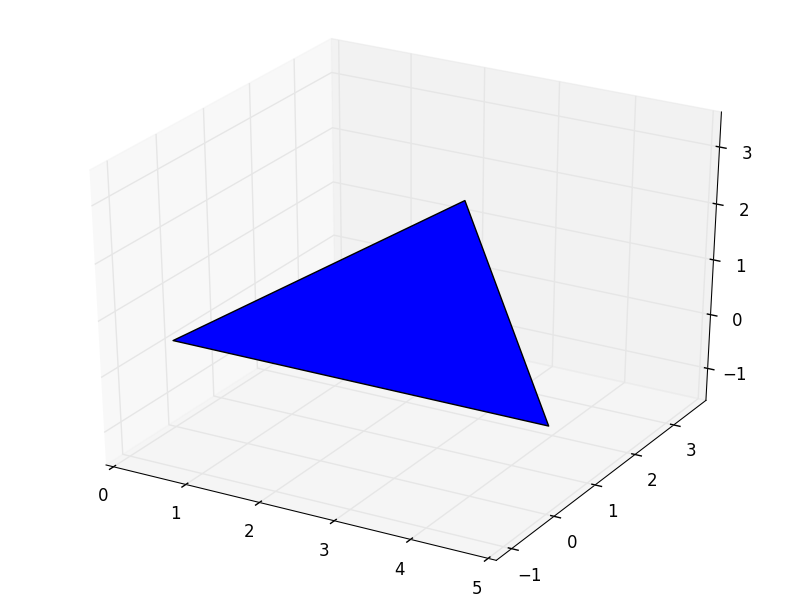

pyny3d documentation
====================

In this page, a extended explanation of all the methods in all the classes is 
addressed. Its purpose is be used as sourcebook to figure out how they can be 
used.

On the other hand, if you prefer a more schematic view of the modules, you
should visit the :ref:`scheme` section. Finally, if you want to see most
of these funtionalities in action, you probably want to take a look to the
:ref:`tutorials` section.

.. contents::
    :local:

``geoms`` module
----------------

.. module:: pyny3d.geoms

.. _doc_polygon:

Polygon
~~~~~~~

   
   *Example of a triangle given by three points: 
   [[0, 0, 0], [5, 0, 0], [2.5, 2.5, 2]]*
   
.. autoclass:: pyny3d.geoms.Polygon
    :members:
    
|
|

.. _doc_surface:

Surface
~~~~~~~

   
   *Example of a Surface formed by four triangles.*
   
.. autoclass:: pyny3d.geoms.Surface
    :members:

|
|

.. _doc_polyhedron:

Polyhedron
~~~~~~~~~~

   
   *Example of a Polyhedron created extruding a polygon along the z axis from
   the ground to the Surface*
   
.. autoclass:: pyny3d.geoms.Polyhedron
    :members:

|
|

.. _doc_place:

Place
~~~~~
.. figure:: ../images/place.png
   :scale: 70%
   :align: center
   
   *Example of a Place with the three objects it can manage: a Surface, a unlimited
   number of Polyhedra and a Set of points.*
   
.. autoclass:: pyny3d.geoms.Place
    :members:
    
|
|

.. _doc_space:

Space
~~~~~

   
   *Example of a Space with six individual Places.*
   
.. autoclass:: pyny3d.geoms.Space
    :members:

|
|

\*root
~~~~~~
.. autoclass:: pyny3d.geoms.root
    :members:

|
|
|

``shadows`` module
------------------

.. module:: pyny3d.shadows

.. _doc_shadowsmanager:

ShadowsManager
~~~~~~~~~~~~~~
.. figure:: ../images/ShadowsManager.png
   :scale: 70%
   :align: center
   
   *Example of a shadowing computation for a four-storey simple structure.*
   
.. autoclass:: pyny3d.shadows.ShadowsManager
    :members:
    
|
|

.. _doc_viz:

Viz
~~~
.. figure:: ../images/Viz.png
   :scale: 35%
   :align: center
   
   *Examples of visualizations. Left to right: Voronoi diagram of the Solar
   Horizont, Frequency of Sun positions in the diagram and timeseries data 
   projected to the diagram.*
   
.. autoclass:: pyny3d.shadows.Viz
    :members:

|
|
|

``utils`` auxiliar module
-------------------------

.. automodule:: pyny3d.utils
    :members:

