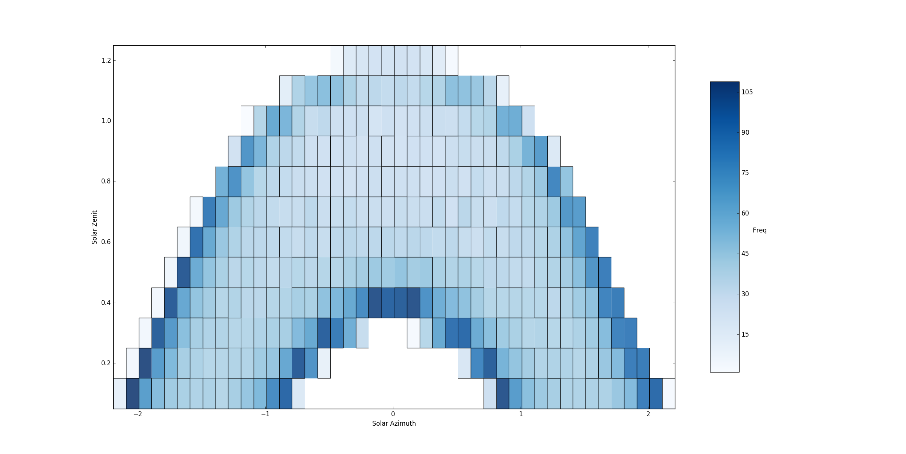

Back to :ref:`tutorials`

.. contents::
    :local:
    
.. _tutorial_pip_and_classify:

PiP and Classify tutorial
=========================
Both ``.pip()`` and ``.classify()`` use the `Point-in-Polygon
<http://matplotlib.org/mpl_toolkits/mplot3d/faq.html>`_ algorithm available in
*matplotlib.path.Path.contains_points*. The reason why I've created these to 
wraps around the matplotlib's algorithm is because, although it is actually
quite fast, it does not take into account the problem context (obviously).

*pyny3d* uses (and abuses) this algorithm to compute shadowing, among other 
secondary processes. Usually there are multiple Polygons and **a lot** of 
points in this calculations and if the matplotlib's version of this algorithm 
were used without modifications, it would check whether each point is in or out
each Polygon, this resulting in a very heavy process. What ``.pip()`` and 
``.classify()`` bring to the table is that they sort the points and the 
Polygons by their positions in the cartesian plane before the calculation 
starts. Knowing the Polygons' bounding boxes (``.get_domain()``) and having the
points sorted, it is possible to slice the space and isolate a small portion of
the points with each Polygon.

We are going to generate a set of points in a mesh and a random set of polygons
in z=0. To do the second we are going to use the Voronoi discretization 
algorithm available in scipy.spatial::

    import numpy as np
    from scipy.spatial import Voronoi
    import pyny3d.geoms as pyny
    from pyny3d.utils import sort_numpy

    # Points (mesh)
    n = 50
    x1 = np.linspace(0, 1, n)
    y1 = np.linspace(0, 1, n)
    x1, y1 = np.meshgrid(x1, y1)
    points = np.array([x1.ravel(), y1.ravel()]).T

    # Polygons
    p = 30
    centers = np.random.rand(p, 2)
    vor = Voronoi(centers)
    ## Looking for finite regions (polygons)
    polygons_list = []
    for vertices in vor.regions[1:]:
        if len(vertices) < 3: continue
        if min(vertices) == -1: continue
        vert = vor.vertices[vertices]
        if vert.max() < 1 and vert.min() > 0:
            polygons_list.append(pyny.Polygon(vert))
    ## Declaring pyny objects
    surface = pyny.Surface(polygons_list)
    polygon = surface[0]
    ## Viz
    polygon.plot2d(alpha=0.5)
    surface.plot2d(alpha=0.5)

.. figure:: ../images/tutorials/pip_and_classify/discretization.png
   :scale: 53%
   :align: center

   *Note that the Polygons have been generated randomly*

pip
---
In practical terms, this method is exactly the same as 
*matplotlib.path.Path.contains_points*. The only that changes is that it is
necessary to have the points previously sorted. We can specify which is the 
sorted column with the *sorted_col* argument.

The matplotlib's version for ``polygon`` and ``points`` is as follows::

    # PiP
    ## matplotlib's pip
    polygon_path = polygon.get_path()
    points_in_polygon = points[polygon_path.contains_points(points)]
    ### Viz
    ax = polygon.plot2d(alpha=0.5, ret=True)
    ax.scatter(points_in_polygon[:, 0], points_in_polygon[:, 1], c='r', 
               s=25, alpha=0.9)
    ax.scatter(points[:, 0], points[:, 1], c='c', s=25, alpha=0.3)
    ax.set_xlim(left=0, right=1)
    ax.set_ylim(bottom=0, top=1)

.. figure:: ../images/tutorials/pip_and_classify/mat_pip.png
   :scale: 53%
   :align: center
    
The pyny3d's pip version::

    ## pyny3d's pip
    points_sorted = sort_numpy(points, col=0, order_back=False)
    polygon.lock()
    points_in_polygon = points[polygon.pip(points_sorted, sorted_col=0)]   
    ### Viz
    ax = polygon.plot2d(alpha=0.5, ret=True)
    ax.scatter(points_in_polygon[:, 0], points_in_polygon[:, 1], c='r', 
               s=25, alpha=0.9)
    ax.scatter(points[:, 0], points[:, 1], c='c', s=25, alpha=0.3)
    ax.set_xlim(left=0, right=1)
    ax.set_ylim(bottom=0, top=1)

.. figure:: ../images/tutorials/pip_and_classify/pyny_pip.png
   :scale: 53%
   :align: center

As we can see, the result is exactly the same, but as we will see later in this
section, the time invested can be an order of magnitude less for the *pyny3d*
version when the number of points are greater than ten thousand.

classify
--------
Calculates the belonging relationship between the polygons
in the Surface and a set of points. That is, given a set of Polygons, grouped
in a Surface, and a set of points it computes inside of which polygon is
each point. As the rest of the similar methods, everything happens in the
z=0 projection of the objects.

For a better understanding, I can tell you that *pyny3d* uses this method to 
generate the *Solar Horizont data projections* where given a discretization of
the Sun positions for a year and a data time series with thousands of samples
with the form of (azimuth, zenit, value) it has to **classify** all the samples
in the appropriate Polygon:

   *In this Surface there are more than 320 polygons and more than 8500 points
   have been classified. The value of each point is 1 so the result of the sum
   for all the points in each polygon is its frequence*
   
Time now for our little example with the points and Surface defined before::

    # Classify
    mapping = surface.classify(points, edge=True, col=0, already_sorted=False)
    ## Viz
    points_out = points[mapping == -1]  # -1 indicates that the point is outside all the polygons
    mapping_in = mapping[mapping != -1]
    points_in = points[mapping != -1]
    ax = surface.plot2d('c', alpha=0.1, ret=True)
    ax.scatter(points_in[:, 0], points_in[:, 1], c=mapping_in, cmap='nipy_spectral', s=20)
    ax.scatter(points_out[:, 0], points_out[:, 1], c='w', s=20, alpha=0.25)
    ax.set_xlim(left=0, right=1)
    ax.set_ylim(bottom=0, top=1)
    
.. figure:: ../images/tutorials/pip_and_classify/pyny_classify.png
   :scale: 53%
   :align: center

As you probably have appreciated, there is no need for sort the point in this
case, it is possible to tell to the method that that *already_sorted=False*. 
Indeed, ``.classify()`` also locks the Surface for you. So, why I have to 
do it manually in ``.pip()``?

The answer is that ``.pip()`` is massively abused in the core of the shadowing 
simulation and adding verifications, locks and sortings would affect 
considerably the performance of the *pyny3d's shadows* module. On the other
side, although ``.classify()``, is also used in some important parts of the 
code, adding some automatic verifications for making our life easier is not
so bad.

The same as before, we already have the points sorted by the *y* column so, it
would be the same (but faster) to write::

    mapping = surface.classify(points, edge=True, col=1, already_sorted=True)
    
Performance
-----------
If your problem is simple and has few points I recommend you to use the 
matplotlib's algorithm because it is simpler. However, if you have thousands
of points and polygons you should take a look to the following charts:

.. figure:: ../images/tutorials/pip_and_classify/performance_pip.png
   :scale: 53%
   :align: center

.. figure:: ../images/tutorials/pip_and_classify/performance_classify_1.png
   :scale: 53%
   :align: center

.. note:: In the case it would be possible not to sort the points because they
    are already sorted by the *y* value (column number 1). Indeed, this is why
    the default column to taken as already sorted is this. I have sorted
    the points by the *x* values (column number 0) for you to see a complete
    example.
   
.. warning:: Remember that if you are going to use *pyny3d* with a lot of 
    polygons and you are completely sure that the are well defined (like this
    case with *scipy.spatial.Voronoi*) it is possible that you want to remove
    the ccw forced verification and conversion by setting 
    ``pyny.Polygon.verify = False`` at the start of your code.

