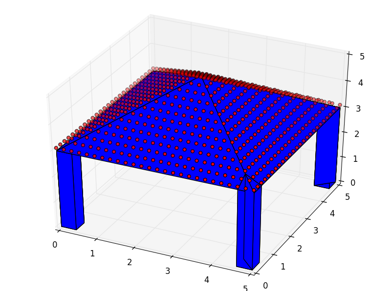
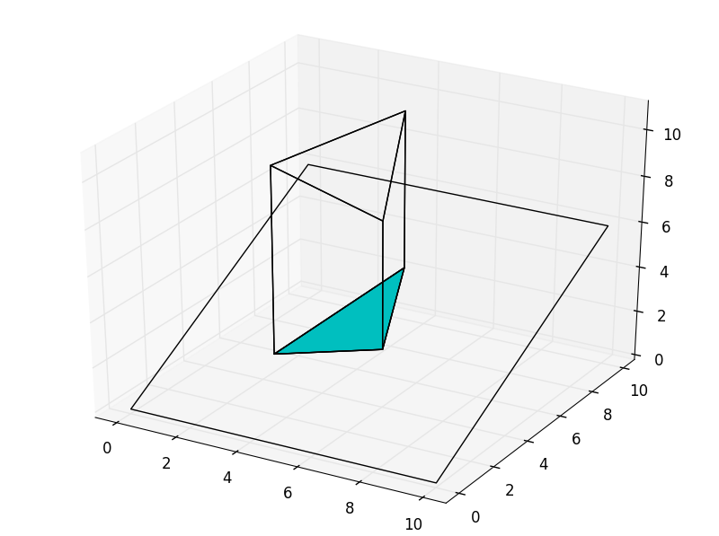
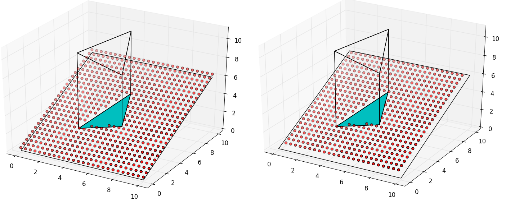

Back to :ref:`tutorials`

.. contents::
    :local:
    
.. _tutorial_place:

Place tutorial
==============

   
   *Example of a Place with the three objects it can manage: a Surface, a unlimited
   number of Polyhedra and a Set of points.*

.. module:: pyny3d.geoms

.. autoclass:: pyny3d.geoms.Place
   :noindex:

Non-trivial methods
-------------------
As always, you can also use the :ref:`doc_place` documentation for 
method-by-method description, specially for the trivial methods we 
are going to skip in this section.

**Trivial methods:**

    ==========================      ===========================================
          method                                    description  
    ==========================      ===========================================
    .add_set_of_points()            Add a set of points
    .clear_set_of_points()          Remove the points in this place
    .get_height()                   Returns the z value for a list of points
    .add_holes()                    Add holes to the surface
    ==========================      ===========================================

The methods to **transform** the classes are explained in detail separately
in :ref:`tutorial_transformations`.

add_extruded_obtacles
~~~~~~~~~~~~~~~~~~~~~
Probably the easiest way to introduce a Polyhedron in *pyny3d* is by 
``.add_extruded_obtacles()`` method. It uses the 
``Polyhedron.by_two_polygons()`` algorithm we saw in the
last tutorial :ref:`tutorial_polyhedron` but only needs one polygon: the top
one. The other required Polygon is automatically computed as the intersection
of a prism which axis is the z axis and its section is the polygon inputed and
the Place's Surface.

Seen otherwise, given a top polygon of an obstacle, the Polyhedron will be
generated by extruding its top to the ground (Surface)::

    import numpy as np
    import pyny3d.geoms as pyny

    # Geometries
    surf_poly = np.array([[0,0,0], [10,0,0], [10,10,6], [0,10,6]])
    obs_top = np.array([[3,3,10], [6,4,8], [5,7,11]])

    # Objects
    place = pyny.Place(surf_poly)
    place.add_extruded_obstacles(obs_top)
    place.iplot()  # transparent is the default color

   
   *Extruded polygon in z axis. ``obs_poly`` is the upper one and the 
   auto-computed is which is in cyan color.*

mesh
~~~~
Generates a xy mesh with a given mesh_size in the 
Place.surface's domain and computes the Surface's height for the
nodes. This mesh is alligned with the main directions `x` and 
`y`. By default, the points will be *attached* to the Place, that is, they
will be added to the current Place's set of points. This mesh will avoid the 
possible holes in the Surface and has the possibility of place points on the 
edges or not.

What makes this method so important is its usage in the shadowing simulations
because it is the easiest way to cover the whole Place (or Space) with sensible
points which will be the real shadowing sensors.

.. ipython::
    :verbatim:

    In [1]: place.mesh(0.4, edge=True)
       ...: place.iplot()
        
    In [2]: place.clear_set_of_points()
       ...: place.mesh(0.4, edge=False)
       ...: place.iplot()
    

   
   *Meshes of points, with and without including edges*
    
|

Next tutorial: :ref:`tutorial_space`

