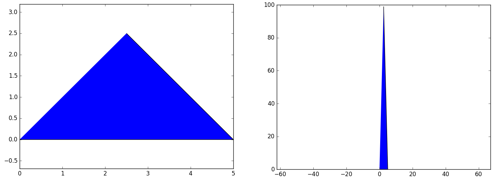

Back to :ref:`tutorials`

.. contents::
    :local:
    
.. _tutorial_polygon:

Polygon tutorial
================
.. figure:: ../images/polygon.png
   :scale: 70%
   :align: center
   
   *Example of a triangle given by three points: 
   [[0, 0, 0], [5, 0, 0], [2.5, 2.5, 2]]*
   
.. module:: pyny3d.geoms

.. autoclass:: pyny3d.geoms.Polygon
    :noindex:

First of all, if performance is important in your use of ``pyny3d`` you must
control the ccw verification. It is active by default but it can be switched
off if you are sure that the Polygons you are going to introduce are well 
ccw ordered. The time expended in the verification can be very high:

.. ipython::
    :verbatim:
    
    In [1]: import numpy as np
         ...: import pyny3d.geoms as pyny
         ...: polygon = np.array([[0,0,0], [7,0,0], [7,10,2], [0,10,2]])    
    
    In [2]: %timeit pyny.Polygon(polygon)
    100 loops, best of 3: 2.27 ms per loop    
    
    In [3]: pyny.Polygon.verify = False    
    
    In [4]: %timeit pyny.Polygon(polygon)
    1000000 loops, best of 3: 1.8 µs per loop    
    
The rest of classes are affected exactly the same:
    
.. ipython::
    :verbatim:
    
    In [5]: pyny.Polygon.verify = True
    
    In [6]: surface_poly = [np.array([[0,0,0], [7,0,0], [7,10,2], [0,10,2]]),
       ...:                 np.array([[0,10,2], [7,10,2], [3,15,3.5]]),
       ...:                 np.array([[0,10,2], [3,15,3.5], [0,15,3.5]]),
       ...:                 np.array([[7,10,2], [15,10,2], [15,15,3.5], [3,15,3.5]])]

    In [7]: %timeit pyny.Place(surface_poly)
    100 loops, best of 3: 9.89 ms per loop
    
    In [8]: pyny.Polygon.verify = False

    In [9]: %timeit pyny.Place(surface_poly)
    100000 loops, best of 3: 11.7 µs per loop
    
    
Non-trivial methods
-------------------
This class, for being the lowest (and the simplest), does actually not require
great explanations. Instead, non-trivial functions will be commented. Trivial 
methods are considered those which are easy enough to be understood
just with the documentation given in :ref:`doc_polygon`. On the other hand, the
non-trivial methods can cause problems if they are not properly observed in 
action.

**Trivial methods:**

    ==================  =======================================================
          method                       description  
    ==================  =======================================================
    .get_path()         Returns the matplotlib.path.Path of the z=0 projection
    .get_shapely()      Returns the shapely.Polygon of the z=0 projection
    .get_area()         Returns the real area
    .get_height()       Returns the z value for the parametric equation for 
                        a list of points
    .is_convex()        Returns whether a polygon is convex
    .make_ccw()         Changes the order of a set of points to be ccw
    .lock()             Precomputes some values to speedup shadowing
    ==================  =======================================================

The methods to **transform** the classes are explained in detail separately
in :ref:`tutorial_transformations`.
    
The ``.pip()`` method is discussed separately in 
:ref:`tutorial_pip_and_classify`.

get_parametric
~~~~~~~~~~~~~~
Computes the parametric equation of the plane that contains 
the polygon. The output has the form np.array([a, b, c, d]) 
for:

.. math::
    a*x + b*y + c*z + d = 0

What makes *non-trivial* this method is that it can verify whether the Polygon
is contained in a plane or not. If ``check`` argument is ``True``, the program
will raise an error.

.. ipython::
    :verbatim:
    
    In [10]: polygon = pyny.Polygon(np.array([[0,0,0], [7,0,0], [7,10,2], [0,10,2]]))
        ...: polygon.get_parametric(True, tolerance=0.01)
    Out[10]: array([0, 14, -70, 0])

    In [11]: non_polygon = pyny.Polygon(np.array([[0,0,-99], [7,0,0], [7,10,2], [0,10,2]]))
        ...: non_polygon.get_parametric(True, tolerance=0.01)
    ValueError: Polygon not plane: 
    [[0  0 -99]
     [7  0  0]
     [7 10  2]
     [0 10  2]]

.. warning:: This verification is not executed automatically. If it is
    required, the only way to do it is by requesting the parametric equation.

to_2d
~~~~~
Generates the real 2D polygon of the 3D polygon.

This library mostly uses the z=0 projection to perform 
operations with the polygons. For this reason, if real 2D
planar operations are required (draw a real matplotlib.path, 
calculate real area...) the best way is to create a new 
``pyny.Polygon`` with this method.

What it actually does is to calculate the 3D rotation matrix that performs
a turn which put the Polygon in the z=0 plane.

.. ipython::
    :verbatim:
    
    In [12]: import matplotlib.pyplot as plt
    ...: polygon = pyny.Polygon(np.array([[0,0,0], [5,0,0], [2.5,2.5,99]]))
    ...: polygon.plot2d()
    ...: 
    ...: polygon.to_2d().plot2d()
    ...: plt.axis('equal')

   *Zenital view of the tilted triangle and the real triangle in z=0*

contains
~~~~~~~~
This method applies the Point in Polygon algorithm for an arbitrary number of 
points and one polygon (without its z position). It depends completely on
``matplotlib.path.Path.contains_points``. The only added modification is that
original ``radius`` float argument has been replaced with ``edge`` boolean
argument.

The method was created primarily for cleanliness. Compare this two identical 
commands:

.. ipython::
    :verbatim:

    In [12]: points = np.array([[0, 0], [2, -0.1], [2, 2], [5, 5], [5.1, 0]])
    
    In [13]: polygon.get_path().contains_points(points, radius=0.001)
    Out[13]: array([True, False, True, False, False], dtype=bool)

    In [14]: polygon.contains(points, True)
    Out[14]: array([True, False, True, False, False], dtype=bool)

|

Next tutorial: :ref:`tutorial_surface`

