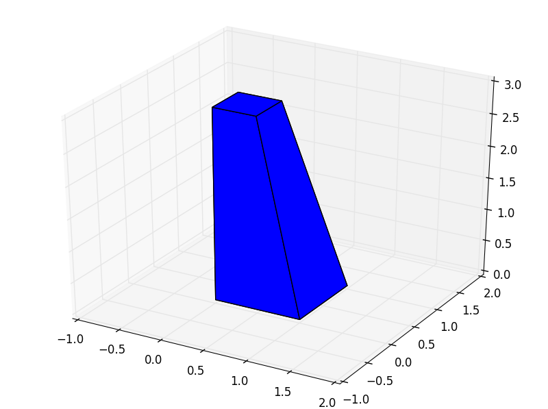

Back to :ref:`tutorials`

.. contents::
    :local:
    
.. _tutorial_polyhedron:

Polyhedron tutorial
===================
.. figure:: ../images/polyhedron.png
   :scale: 70%
   :align: center
   
   *Example of a Polyhedron created extruding a polygon along the z axis from
   the ground to the Surface*
   
.. module:: pyny3d.geoms

.. autoclass:: pyny3d.geoms.Polyhedron
    :noindex:

Non-trivial methods
-------------------
As always, you can also use the :ref:`doc_polyhedron` documentation for 
method-by-method description.

In this section we are going to see only the ``.by_two_polygons()`` method due
to the Polyhedron class is pretty simple and has not barely any own methods.

by_two_polygons
~~~~~~~~~~~~~~~
Static method. This method creates a closed Polyhedron by connecting two 
polygons. Both polygons must have the same number of vertices. These two 
polygons can be considered the top and the bottom and the rest of its faces 
(lateral ones) will be generated by matching the polygons' vertices two by two.

It is important to note that the given polygons (arguments) can be in 
``pyny.Polygon`` format or simply in ``ndarray``.

Without further delay, an example::

    import numpy as np
    import pyny3d.geoms as pyny

    poly1 = pyny.Polygon(np.array([[0, 0, 0], [1, 0, 0], [1, 1, 0], [0, 1, 0]]))
    poly2 = pyny.Polygon(np.array([[0, 0, 3], [0.5, 0, 3], [0.5, 0.5, 3], [0, 0.5, 3]]))
    polyhedron = pyny.Polyhedron.by_two_polygons(poly1, poly2)
    polyhedron.plot('b')

   *Generated Polyhedron by the top and bottom Polygons*

.. warning:: If an error is raised, probably the Polyhedron
    have non-planar faces.

|

Next tutorial: :ref:`tutorial_place`

