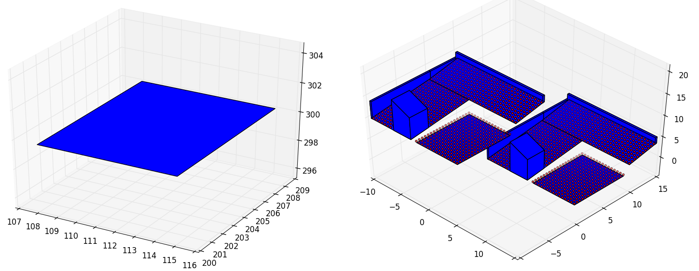
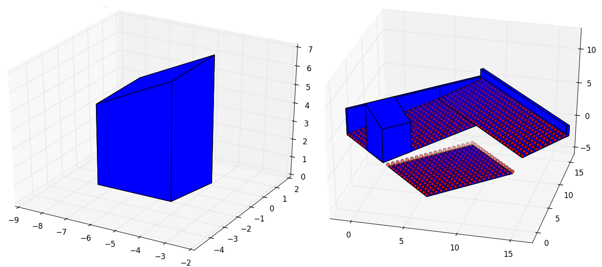
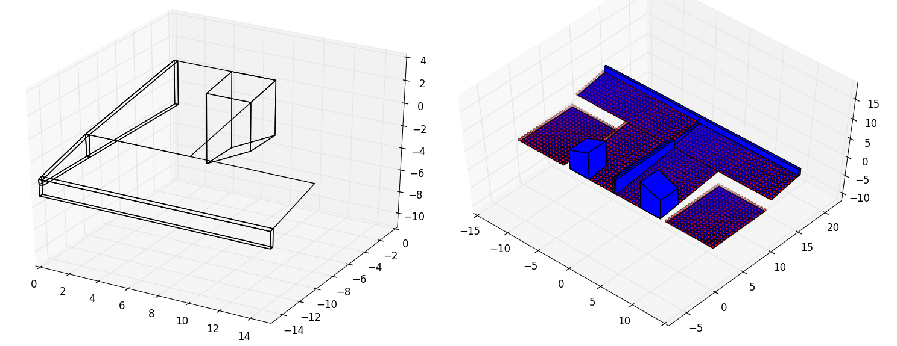
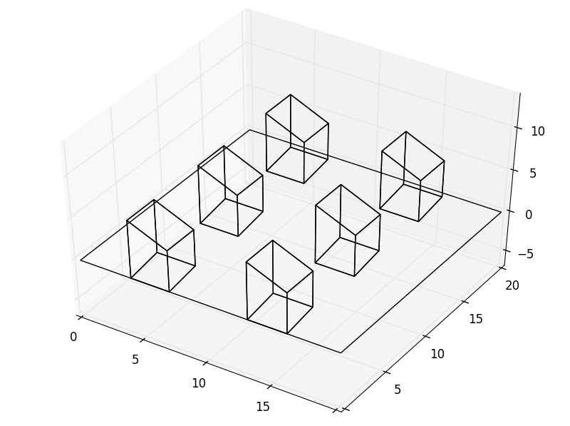

Back to :ref:`tutorials`

.. contents::
    :local:
    
.. _tutorial_transformations:

Transformations
===============
*pyny3d* have some global methods to transform objects. These are ``.move()``, 
``.zrotate()``, ``.mirror()`` and ``.matrix()``. In this section we are
going to see some examples for all of them for the following geometry::

    import numpy as np
    import pyny3d.geoms as pyny

    # Declaring the geometry
    polygon = pyny.Polygon(np.array([[8,0], [15,0], [15,9], [8,9]]))
    
    ## Surface
    poly_surf_0 = [np.array([[0,0,0], [7,0,0], [7,10,2], [0,10,2]]),
                   np.array([[0,10,2], [7,10,2], [3,15,3.5]]),
                   np.array([[0,10,2], [3,15,3.5], [0,15,3.5]]),
                   np.array([[7,10,2], [15,10,2], [15,15,3.5], [3,15,3.5]])]

    ## Obstacles
    wall_1 = np.array([[0,0,4], [0.25,0,4], [0.25,15,4], [0,15,4]])
    wall_2 = np.array([[0,14.7,5], [15,14.7,5], [15,15,5], [0,15,5]])
    chimney = np.array([[4,0,7], [7,0,5], [7,3,5], [4,3,7]])

    # Building the solution
    place_0 = pyny.Place(poly_surf_0, melt=True)
    place_0.add_extruded_obstacles([wall_1, wall_2, chimney])
    polyhedron = place_0.polyhedra[-1]
    place_1 = pyny.Place(pyny.Surface(polygon))
    space = pyny.Space([place_0, place_1])
    space.mesh(0.5)
    
    # Viz
    space.iplot(c_poly='b')

.. figure:: ../images/tutorials/1_building_by_aggregation/space_1.png
   :scale: 60%
   :align: center

It is important to note that in the case that the object we want to transform
is a Space, we have, except for ``.zrotate()`` the *inplace* option. Activating
it we can tell to the library to automatically add the transformed form of the
object to the current Space. For the rest of classes this lacks of sense and 
they will return independent instances or lists of intances.

For example, it is completely normal to *move* a building and add add the copy
to the same Space of the original but it is incongruent to *move* a Polygon
and add the new Polygon to the same Polygon instance. A Polygon object only
contains one Polygon.
   
move
----
This method is the simplest one. Indeed we will see how it works in the 
:ref:`tutorial_space` section. We only need to give the distance we want to 
displace in a *tuple* or *ndarray*:

.. ipython::
    :verbatim:

    In [1]: polygon_moved = polygon.move((100, 200, 300))
       ...: polygon_moved.plot('b')

    In [2]: space.save()
       ...: space.move((-10, -10, 10), inplace=True)
       ...: space.iplot(c_poly='b', s_sop=10)
       ...: space = space.restore()  # restore the Space to the state before the duplication

   
zrotate
-------
It is possible to rotate all the elements in an object through a matrix 
operation that changes its the reference system. If the *axis* argument is
left None (by default) the rotation will be done about the centroid.

.. ipython::
    :verbatim:

    In [3]: polyhedron_rotated = polyhedron.zrotate(np.pi)
       ...: polyhedron_rotated.plot('b')

    In [4]: space_rotated = space.zrotate(-np.pi/4)
       ...: space_rotated.iplot(c_poly='b')
        

        
mirror
------
Generates a symmetry of the Space respect global axes. If ``'x'`` is inputed,
the symmetry will be done so that all the *x* coordinates now will be *-x*. It
is also possible to do multiple symmetries at once by introducing, for 
example ``'xy'``.
    
.. ipython::
    :verbatim:

    In [5]: place_symmetry = place_0.mirror('yz')
       ...: place_symmetry.plot('t')  # better visualization

    In [6]: space.save()
       ...: space.mirror('x', inplace=True)
       ...: space.iplot(c_poly='b', s_sop=10)
       ...: space = space.restore()

    

    
matrix
------
This function is actually the ``.move()`` method repeated for the main 
directions. The first number of the tuple is the times that the object has to 
be repeated and the second one is the distance between the same point for 
the copies.

.. ipython::
    :verbatim:

    In [7]: polyhedra_list = polyhedron.matrix(x=(2, 9), y=(3, 8))
       ...: place = pyny.Place(surface=np.array([[0, 0], [20, 0], [20, 20], [0, 20]]),
       ...:                    polyhedra=polyhedra_list)
       ...: place.plot('t')

|

Next tutorial: :ref:`tutorial_polygon`

