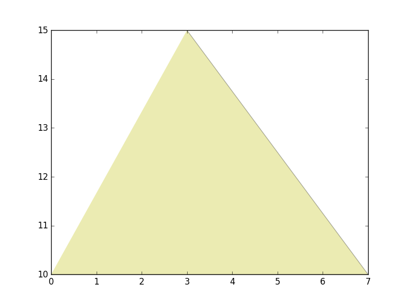

Back to :ref:`tutorials`

.. contents::
    :local:
    
.. _tutorial_visualizations:

Visualization
=============
Every class in *pyny3d* has, at least, one way to be visualized: the 
``.plot()`` method. In addition, there are other methods that allow for
different kinds of visualizations.

Again, we will use this geometry as example::

    import numpy as np
    import pyny3d.geoms as pyny

    # Declaring the geometry
    ## Surface
    poly_surf = [np.array([[0,0,0], [7,0,0], [7,10,2], [0,10,2]]),
                 np.array([[0,10,2], [7,10,2], [3,15,3.5]]),
                 np.array([[0,10,2], [3,15,3.5], [0,15,3.5]]),
                 np.array([[7,10,2], [15,10,2], [15,15,3.5], [3,15,3.5]])]

    ## Obstacles
    wall_1 = np.array([[0,0,4], [0.25,0,4], [0.25,15,4], [0,15,4]])
    wall_2 = np.array([[0,14.7,5], [15,14.7,5], [15,15,5], [0,15,5]])
    chimney = np.array([[4,0,7], [7,0,5], [7,3,5], [4,3,7]])

    # Building the solution
    place = pyny.Place(poly_surf_0, melt=True)
    place.add_extruded_obstacles([wall_1, wall_2, chimney])
    place.mesh(0.5)
    
    # Viz
    place.iplot(c_poly='b')

plot
----
This is the most simple visualization tool, it represents an object in 
3D. The only argument to control the representation it has is *color*, and
what it does is pretty simple and intuitive.

As *color*, it is possible to indicate any kind of color that matplotlib
accepts plus a new option: 't' for transparent. Indeed, transparent is the
color by default because, as you probably know already, matplotlib has serious
problems identifying what is in front or behind in 3D representations.

One interesting capability of ``.plot()`` is that you can easily use it as a
part in bigger processes (primarily loops) making plots in cascade thanks to
its *ret* and *ax* arguments:

    * ret: If True, returns the figure.
    * ax: Whatever you want to represent will be on top of the *ax* axes.
    
In the :ref:`tutorial_pip_and_classify` you can see some examples of *ret* 
usage.
    
iplot
-----
*iplot* is an improved version of *plot* that allows to plot polygons, holes
and points in different colors. Due to neither Polygon nor Polyhedron classes
have anything different than polygons, these classes do not have this method.

An example for Surface:

.. ipython::
    :verbatim:

    In [1]: place.surface.iplot()
    

By default, Polygons are represented in transparent (c_poly='t') and 
holes in cyan (c_holes='c'). Due to the matplotlib 3D representation 
overlapping problems it is a good solution repersent the bigger things in 
transparent and the smaller in color. Surface has no Set of Points associated,
so *iplot* does not have arguments for them here.

An example for Space:

.. ipython::
    :verbatim:

    In [2]: place.iplot(c_poly='t', c_holes='g', s_sop=60, c_sop='k')
    

Finally, it is important to remark that *iplot* also have the *ret* and *ax*
options.

plot2d
------
Only Polygon and Surface classes have this method. With it, we can visualize
coloured z=0 projections of the objects. In the case of Polygons, the color
can be only one but, for Surfaces, it is possible to introduce color scales
and require a colorbar in the result. For both classes, it is possible to
set some grade of transparency.

For polygons:

.. ipython::
    :verbatim:

    In [3]: polygon = place.surface[-1]
       ...: polygon.plot2d('y', alpha=0.3)

   
.. ipython::
    :verbatim:

    In [4]: place.surface.plot2d() # plot by default
       ...: color_scale = np.arange(len(place.surface.polygons))
       ...: import matplotlib.cm as cm
       ...: color_map = cm.rainbow
       ...: place.surface.plot2d(c_poly=color_scale, alpha=0.7, cmap=color_map, colorbar=True)  # coloured plot
       

This method was created to make visualizations like this in the *shadows* 
module:

   
|

Next tutorial: :ref:`tutorial_transformations`

