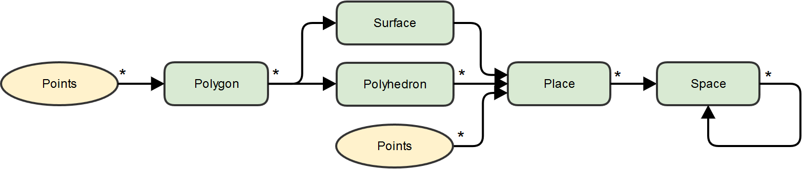
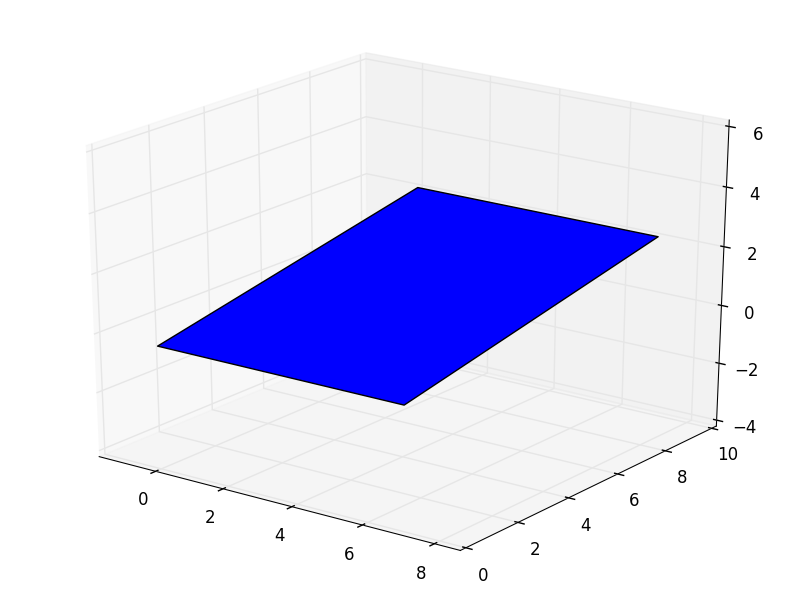
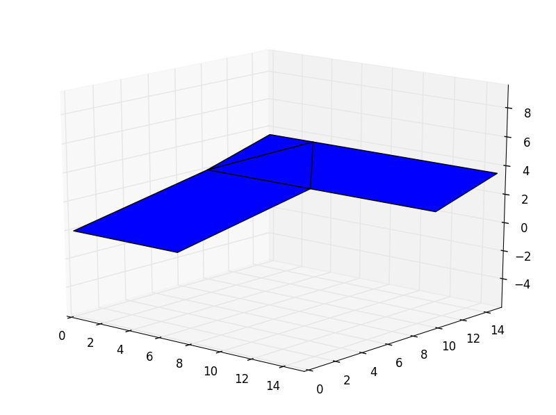
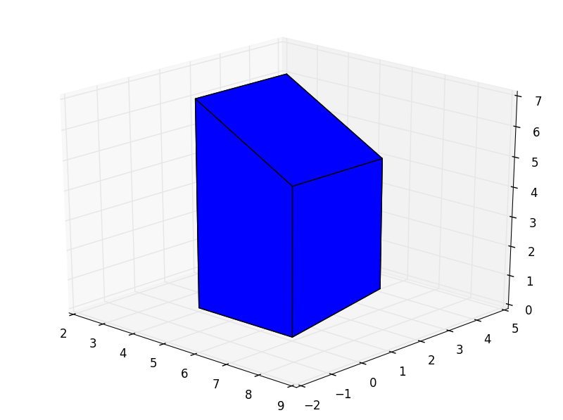
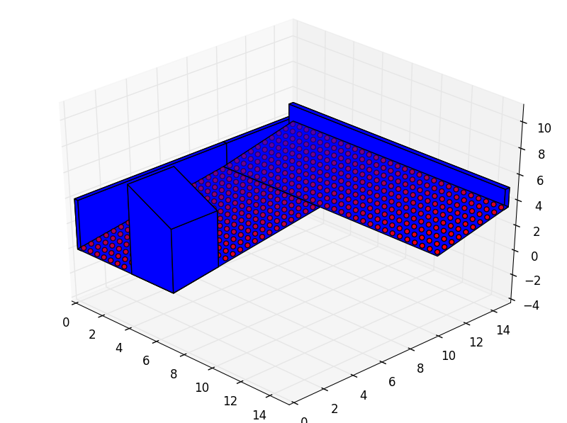
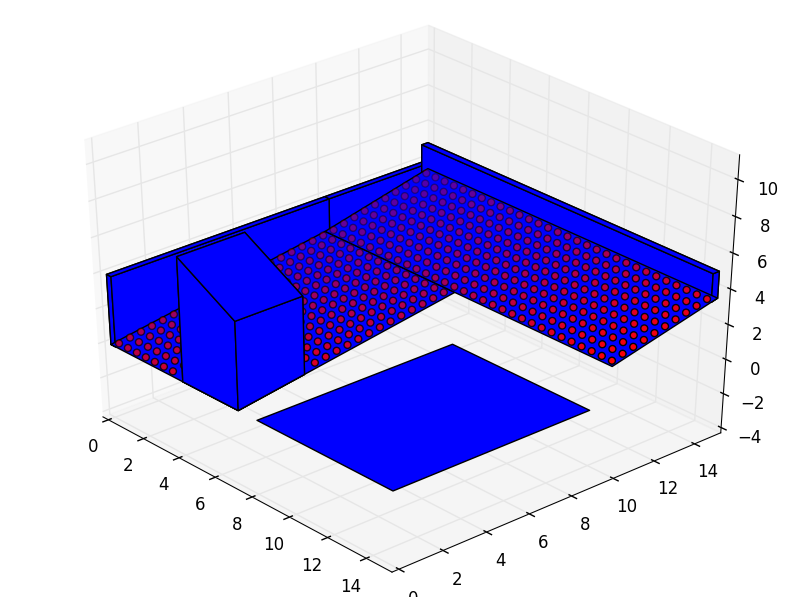

Back to :ref:`tutorials`

.. contents::
    :local:

.. _tutorial_building_by_aggregation:
    
Building by aggregation
=======================
In *pyny3d*, **everything is an aggregation of smaller objects.** Even the 
lowest class, the Polygon, can be considered as a sequence of points.

As a 3D recreation grows the complexity is also raising, but if the general
scheme is well understood all the problems will be solved with a simple look
to the documentation.

   
   *Simple Class Diagram (classes in green)*

**Multiple ordered Points form a Polygon. Multiple Polygons can form either a 
Surface or a Polyhedron. One Surface and multiple Polyhedra and Points form
a Place. Multiple Places form a Space. And finally, an arbitrary number of 
Spaces can be aggregated to form a larger Space.**

Classes initialization
----------------------
First of all, we have to import the required packages::
    
    import numpy as np
    import pyny3d.geoms as pyny

In order to ease the call to the ``geoms`` module, it is convenient to
rename the whole sequence of ``pyny3d.geoms`` simply as ``pyny``.

Polygon
~~~~~~~
Although this class represent a 3D polygon, it is important to note that they
have to been planar and convex. By default, when a ``pyny.Polygon`` is 
initialized its convexity and counterclock wise orded is imposed
and when its parametric equation is required so is its planarity.

Polygons (doc: :ref:`doc_polygon`) can only be initialized using a ``ndarray`` 
where the columns are x, y, z coordinates and the rows are the ordered points 
that form the Polygon. This way, if we want to create a Polygon formed by the 
following points:

    ======  =====  =====  =====
      nº    **x**  **y**  **z**
    ======  =====  =====  =====
    **0**   0      0      0 
    **1**   7      0      0
    **2**   7      10     2
    **3**   0      10     2
    ======  =====  =====  =====

we first have to create the ndarray and then initializes the ``pyny.Polygon``
with it::

    ordered_points = np.array([[0,  0, 0], 
                               [7,  0, 0], 
                               [7, 10, 2], 
                               [0, 10, 2]])
    polygon = pyny.Polygon(ordered_points)

At this point, we already have a ready-to-use ``pyny.Polygon``. Probably, the
first thing you will want to do is to check it visually. To do so, you can
simply use the ``.plot()`` method that all classes have::

    polygon.plot('b')   # 'b' indicates blue color
    

Surface
~~~~~~~
A Surface (doc: :ref:`doc_surface`) is a group of contiguous Polygons. It is 
possible, depending on their distribution, that some methods work for a 
non-contiguous surfaces but it is very important to remark that the whole 
library have been developed under the hypothesis that they are not. Please, if 
you need to work with disperse groups of polygons, use multiple surfaces and 
englobe them in superior structures (Space).

To initialize a Surface, both a list of ``pyny.Polygons`` or a list of ndarrays
can be used. This two ways of initializing a Surface are identical::

    # Polygon by Polygon (redundant)
    polygon_0 = np.array([[0,0,0], [7,0,0], [7,10,2], [0,10,2]])
    polygon_0 = pyny.Polygon(polygon_0)
    
    polygon_1 = np.array([[0,10,2], [7,10,2], [3,15,3.5]])
    polygon_1 = pyny.Polygon(polygon_1)
    
    polygon_2 = np.array([[0,10,2], [3,15,3.5], [0,15,3.5]])
    polygon_2 = pyny.Polygon(polygon_2)
    
    polygon_3 = np.array([[7,10,2], [15,10,2], [15,15,3.5], [3,15,3.5]])
    polygon_3 = pyny.Polygon(polygon_3)
    
    surface_0 = pyny.Surface([polygon_0, polygon_1, polygon_2, polygon_2])
    
    
    # Simultaneously (clearer)
    polygons_list = [np.array([[0,0,0], [7,0,0], [7,10,2], [0,10,2]]),
                     np.array([[0,10,2], [7,10,2], [3,15,3.5]]),
                     np.array([[0,10,2], [3,15,3.5], [0,15,3.5]]),
                     np.array([[7,10,2], [15,10,2], [15,15,3.5], [3,15,3.5]])]
    surface_0 = pyny.Surface(polygons_list)

As we did before, the best way to verify the Surface is to plot it::

    surface_0.plot('b')

   
As you can see in the figure above, the Surface is actually a composition of
two rectangles and one of them is, at the same time, a composition of two 
triangles and a trapezium. It is possible in *pyny3d* to **melt** the polygons
which are complanars and contiguous at initialization of a Surface by::

    surface_0 = pyny.Surface(polygons_list, melt=True)
    surface_0.plot('b')
    
Melting multiple polygons can speedup heavy calculations (specially at 
shadowing) and makes easier handle the geometries. On the other hand, make sure
that you previosly undertand the ``.melt()`` limitations 
(doc: :ref:`doc_surface`).

Polyhedron
~~~~~~~~~~
Polyhedron (doc: :ref:`doc_polyhedron`) represents 3D polygon-based convex 
Polyhedra. It is initialized by the polygons which form its faces in a very 
similar way as the Surface does::

    faces_list = [np.array([[7,3,5], [7,0,5], [7,0,0],   [7,3,0.6]]),
                  np.array([[7,0,5], [4,0,7], [4,0,0],   [7,0,0]]),
                  np.array([[4,0,7], [4,3,7], [4,3,0.6], [4,0,0]]),
                  np.array([[4,3,7], [7,3,5], [7,3,0.6], [4,3,0.6]]),
                  np.array([[7,0,0], [4,0,0], [4,3,0.6], [7,3,0.6]]),
                  np.array([[7,0,5], [4,0,7], [4,3,7],   [7,3,5]])]
    polyhedron_0 = pyny.Polyhedron(faces_list)
    polyhedron_0.plot('b')

Initialize Polyhedra this way is very verbose because given information is
redundant about the faces. A far more convenient way to introduce a 
Polyhedron is giving just the top and the bottom Polygons and telling to the
class that a connection between them is needed::

    bottom = np.array([[7,0,5], [4,0,7], [4,3,7],   [7,3,5]])
    top =    np.array([[7,0,0], [4,0,0], [4,3,0.6], [7,3,0.6]])
    polyhedron_0 = pyny.Polyhedron.by_two_polygons(top, bottom)

Both Polyhedra created are exactly the same one. Finally, it exists a better
way to create new Polyhedra by extruding a Polygon from a given position 
to a Surface, what it is called "extruded obstacles". The method 
``.add_extruded_obstacles()`` is in the Place class due to Surfaces, and 
Polyhedra are aggregated there.

Thanks to these ways, you will probably never need to use the ``polygon_list`` 
initialization.

Place
~~~~~
Places (doc: :ref:`doc_place`) are initialized giving a Surface, a list of
Polyhedra and a Set of Points but actually, the only indispensable one is
the Surface.

If we have already created the necessary objects, then we can use this simple
way::

    place_0 = pyny.Place(surface_0, polyhedron_0)
    place_0.plot('b')

.. figure:: ../images/tutorials/1_building_by_aggregation/place.png
   :scale: 60%
   :align: center

A Place can also be created giving directly the polygons that form its 
surface::

    place_0 = pyny.Place(polygons_list, polyhedron_0)

The Place class is a dynamic one. It was conceived to be easily edited once
created with methods like ``.mesh()`` or ``.add_extruded_obstacles()``, here
in action::

    wall_1 = np.array([[0,0,4],    [0.25,0,4],  [0.25,15,4], [0,15,4]])
    wall_2 = np.array([[0,14.7,5], [15,14.7,5], [15,15,5],   [0,15,5]])
    place_0.add_extruded_obstacles([wall_1, wall_2])
    place_0.mesh(0.5)   # distance between points
    place_0.plot('b')

Adding some points is possible by independently generate and inserting them 
through ``.add_set_of_points()`` but if you want to simply create a regular 
distributed set of points it is easier to use ``.mesh()``.

Space
~~~~~
Space (doc: :ref:`doc_place`) does not bring any new concept, it is only an
aggregation of Places with the goal of being a container that makes possible
global transformations with very few commands. As Place, Space is a very 
dynamic class which has a lot methods to interactively use it. For this reason,
it is possible to build a Space through several ways.

The first and simplest way to create a Space is by giving a list of Places as
argument::

    poly_surf = np.array([[8,0,0], [15,0,0], [15,9,0], [8,9,0]])
    place_1 = pyny.Place(poly_surf)
    space = pyny.Space([place_0, place_1])

Furthermore, it can be initialized empty and the elements can be added later::

    space = pyny.Space()
    space.add_places([place_0, place_1])

Combining multiple Spaces is as simple as::

    space = pyny.Space(place_0)
    space_1 = pyny.Space(place_1)
    space.add_spaces(space_1)

All these code snippets create the same result:

Note that the ``place_0`` has brought the set of points with it while the new
place (``place_1``) has not any point declared. If a more uniformed set of 
points is required the easiest way is to clear the old and create a new one::

    space.clear_sets_of_points()
    space.mesh(0.5)
    space.iplot(c_poly='b')

.. figure:: ../images/tutorials/1_building_by_aggregation/space_1.png
   :scale: 60%
   :align: center

In short
--------
All the steps above can be written just in five lines to generate exactly 
the last output::

    import numpy as np
    import pyny3d.geoms as pyny

    # Declaring the geometry
    ## Surface
    poly_surf_0 = [np.array([[0,0,0], [7,0,0], [7,10,2], [0,10,2]]),
                   np.array([[0,10,2], [7,10,2], [3,15,3.5]]),
                   np.array([[0,10,2], [3,15,3.5], [0,15,3.5]]),
                   np.array([[7,10,2], [15,10,2], [15,15,3.5], [3,15,3.5]])]
    poly_surf_1 = [np.array([[8,0,0], [15,0,0], [15,9,0], [8,9,0]])]

    ## Obstacles
    wall_1 = np.array([[0,0,4], [0.25,0,4], [0.25,15,4], [0,15,4]])
    wall_2 = np.array([[0,14.7,5], [15,14.7,5], [15,15,5], [0,15,5]])
    chimney = np.array([[4,0,7], [7,0,5], [7,3,5], [4,3,7]])

    # Building the solution
    place_0 = pyny.Place(poly_surf_0, melt=True)
    place_0.add_extruded_obstacles([wall_1, wall_2, chimney])
    place_1 = pyny.Place(poly_surf_1)
    space = pyny.Space([place_0, place_1])
    space.mesh(0.5)
    
    # Viz
    space.iplot(c_poly='b')

|

Next tutorial: :ref:`tutorial_basic_usage`

