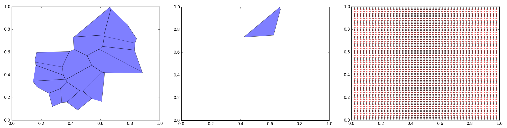
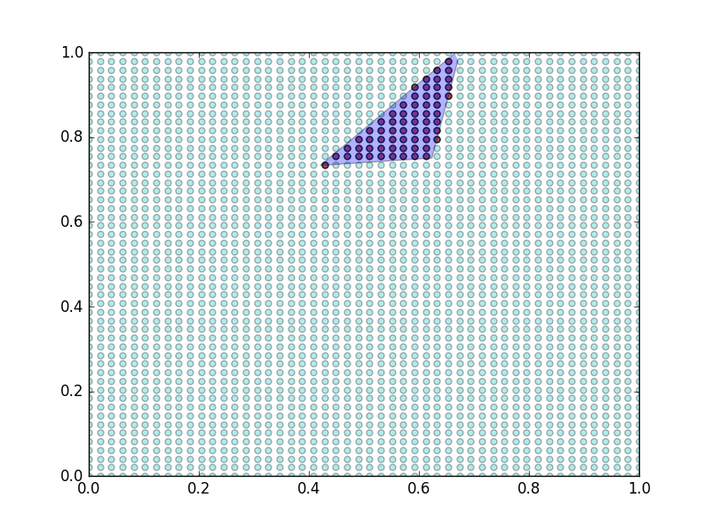
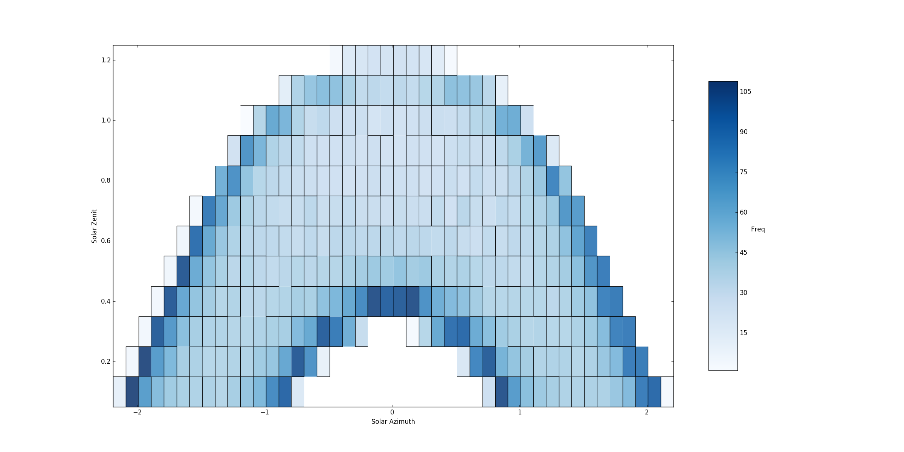
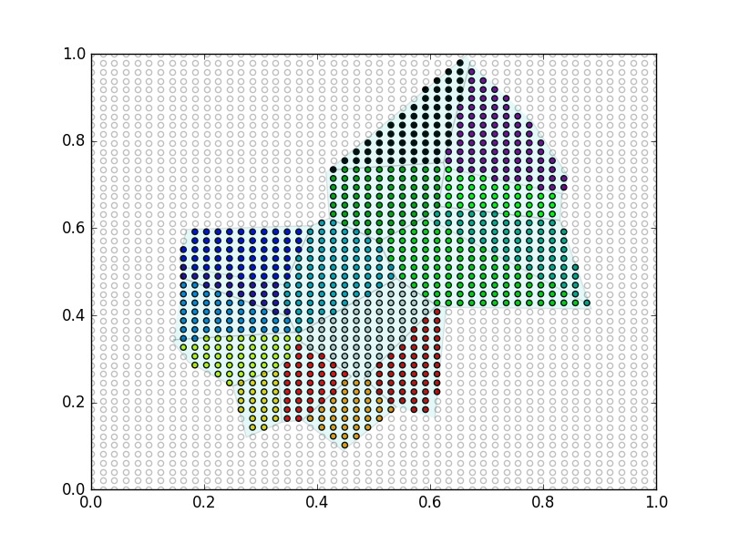
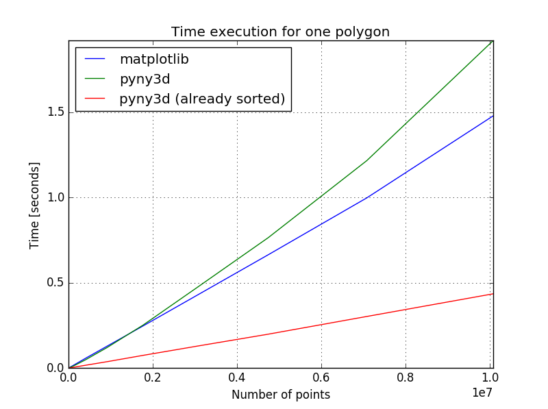
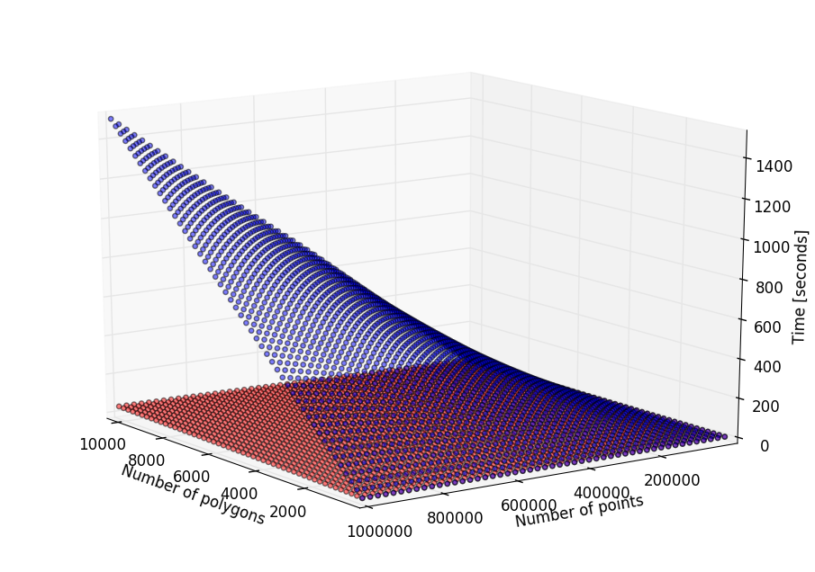
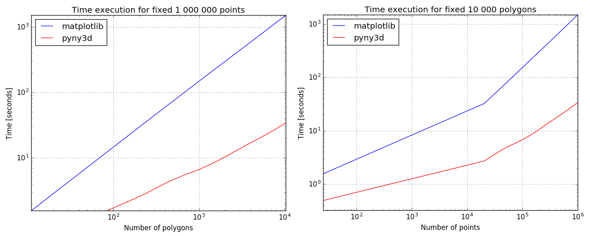

Back to :ref:`tutorials`

.. contents::
    :local:
    
.. _tutorial_pip_and_classify:

PiP and Classify tutorial
=========================
Both ``.pip()`` and ``.classify()`` use the `Point-in-Polygon
<http://matplotlib.org/mpl_toolkits/mplot3d/faq.html>`_ algorithm available in
*matplotlib.path.Path.contains_points*. The reason why I've created these to 
wraps around the matplotlib's algorithm is because, although it is actually
quite fast, it does not take into account the problem context (obviously).

*pyny3d* uses (and abuses) this algorithm to compute shadowing, among other 
secondary processes. Usually there are multiple Polygons and **a lot** of 
points in this calculations and if the matplotlib's version of this algorithm 
were used without modifications, it would check whether each point is in or out
each Polygon, this resulting in a very heavy process. What ``.pip()`` and 
``.classify()`` bring to the table is that they sort the points and the 
Polygons by their positions in the cartesian plane before the calculation 
starts. Knowing the Polygons' bounding boxes (``.get_domain()``) and having the
points sorted, it is possible to slice the space and isolate a small portion of
the points with each Polygon.

We are going to generate a set of points in a mesh and a random set of polygons
in z=0. To do the second we are going to use the Voronoi discretization 
algorithm available in scipy.spatial::

    import numpy as np
    from scipy.spatial import Voronoi
    import pyny3d.geoms as pyny
    from pyny3d.utils import sort_numpy
    import matplotlib.pyplot as plt

    def plot_limits(ax):
        """
        Set the x and y limits of a plot from 0 to 1.
        """
        ax.set_xlim(left=0, right=1)
        ax.set_ylim(bottom=0, top=1)

    np.random.seed(seed=3)

    # Points (mesh)
    n = 50
    x1 = np.linspace(0, 1, n)
    y1 = np.linspace(0, 1, n)
    x1, y1 = np.meshgrid(x1, y1)
    points = np.array([x1.ravel(), y1.ravel()]).T

    # Surface and Polygon
    p = 30
    centers = np.random.rand(p, 2)
    vor = Voronoi(centers)
    ## Looking for finite regions (polygons)
    polygons_list = []
    for vertices in vor.regions[1:]:
        if len(vertices) < 3: continue
        if min(vertices) == -1: continue
        vert = vor.vertices[vertices]
        if vert.max() < 1 and vert.min() > 0:
            polygons_list.append(pyny.Polygon(vert))
    ## Declaring pyny objects
    surface = pyny.Surface(polygons_list)
    polygon = surface[0]  
      
    # Viz
    ## Polygon
    ax = polygon.plot2d(alpha=0.5, ret=True)
    plot_limits(ax)
    ## Surface
    ax = surface.plot2d(alpha=0.5, ret=True)
    plot_limits(ax)
    ## Points
    fig = plt.figure()
    ax = fig.add_subplot(111)
    ax.scatter(points[:, 0], points[:, 1], c='r', s=15, alpha=0.7)
    plot_limits(ax)

   *Note that the Polygons have been generated randomly*

pip
---
In practical terms, this method is exactly the same as 
*matplotlib.path.Path.contains_points*. The only that changes is that it is
necessary to have the points previously sorted. We can specify which is the 
sorted column with the *sorted_col* argument.

The matplotlib's version for ``polygon`` and ``points`` is as follows::

    # PiP
    ## matplotlib's pip
    polygon_path = polygon.get_path()
    points_in_polygon = points[polygon_path.contains_points(points)]
    ### Viz
    ax = polygon.plot2d(alpha=0.3, ret=True)
    ax.scatter(points_in_polygon[:, 0], points_in_polygon[:, 1], c='r', s=25, alpha=0.9)
    ax.scatter(points[:, 0], points[:, 1], c='c', s=25, alpha=0.3)
    plot_limits(ax)

   
   *Points in red are inside the polygon while points in cyan are outside*
    
The pyny3d's pip version produce the same output::

    ## pyny3d's pip
    points_sorted = sort_numpy(points, col=0, order_back=False)
    polygon.lock()
    points_in_polygon = points_sorted[polygon.pip(points_sorted, sorted_col=0)]   
    ### Viz
    ax = polygon.plot2d(alpha=0.3, ret=True)
    ax.scatter(points_in_polygon[:, 0], points_in_polygon[:, 1], c='r', s=25, alpha=0.9)
    ax.scatter(points[:, 0], points[:, 1], c='c', s=25, alpha=0.3)
    plot_limits(ax)

As we will see later in this section, the big difference here is that we can
speed up this kind of operations by grouping some steps.

In this case, it would not be necessary to sort the set of points because
the numpy's ``meshgrid()`` function left the output already sorted by the 
second column (the *y* value). Due to most of the time the points are generated
through that function, the default value for *sorted_col* is 1. In the last
example it would be equivalent (and faster) just to write::

    polygon.lock()
    points_in_polygon = points[polygon.pip(points)]   

classify
--------
Calculates the belonging relationship between the polygons
in the Surface and a set of points. That is, given a set of Polygons, grouped
in a Surface, and a set of points it computes inside of which polygon is
each point. As the rest of the similar methods, everything happens in the
z=0 projection of the objects.

For a better understanding, I can tell you that *pyny3d* uses this method to 
generate the *Solar Horizont data projections* where given a discretization of
the Sun positions for a year and a data time series with thousands of samples
with the form of (azimuth, zenit, value) it has to **classify** all the samples
in the appropriate Polygon:

   *In this Surface there are more than 320 polygons and more than 8500 points
   have been classified. The value of each point is 1 so the result of the sum
   for all the points in each polygon is its frequence*
   
Time now for our little example with the points and Surface defined before::

    # Classify
    mapping = surface.classify(points, edge=True, col=0, already_sorted=False)
    ## Viz
    points_out = points[mapping == -1]
    mapping_in = mapping[mapping != -1]
    points_in = points[mapping != -1]
    ax = surface.plot2d('c', alpha=0.1, ret=True)
    ax.scatter(points_in[:, 0], points_in[:, 1], c=mapping_in, cmap='nipy_spectral', s=20)
    ax.scatter(points_out[:, 0], points_out[:, 1], c='w', s=20, alpha=0.25)
    plot_limits(ax)
    

   
   *Points in transparent white are those outside polygons (they have a -1 
   value in ``mapping``). Points in color have been classified and represeted
   depending on the polygon they belong*

As you probably have appreciated, there is no need for sort the point in this
case, it is possible to tell to the method that that *already_sorted=False*. 
Indeed, ``.classify()`` also locks the Surface for you. So, why I have to 
do it manually in ``.pip()``?

The answer is that ``.pip()`` is massively abused in the core of the shadowing 
simulation and adding verifications, locks and sortings would affect 
considerably the performance of the *pyny3d's shadows* module. On the other
side, although ``.classify()``, is also used in some important parts of the 
code, adding some automatic verifications for making our life easier is not
so bad.

The same as before, we already have the points sorted by the *y* column so, it
would be the same (but faster) to write::

    mapping = surface.classify(points, edge=True, col=1, already_sorted=True)
    
Performance
-----------
pip
~~~
For a single polygon, the difference between matplotlib's ``.contains_points()``
and pyny3d's ``.pip()`` is not so great, but still it exists. The main question
here is if it is worth to sort the points and to lock the polygon or if it is
faster just to use ``.contains_points()`` directly. The answer will depend on
the ability of the problem to be grouped, that is, if your problem has multiple
polygons and multiple sets of points but those are already sorted it is 
possible that you can speed up the execution because you only have to lock
the polygons once. however, if you have unpredictable sets of points and
polygons possibly try to keep everything in order is a waste of time.

Here we have a comparison between the three posibilities described:

   *The pyny3d's execution includes sorting the points and locking the polygon
   while the "already sorted" version do not include any of those*
   
To illustrate this, I can tell that whole shading process that perform
*pyny3d* decreased its global computing time investement by half when I 
replaced the general matplotlib's ``.contains_points()`` to the more
specialised pyny3d's ``.pip()``.
   
classify
~~~~~~~~
If your problem is simple and it has few points I recommend you to use the 
matplotlib's algorithm because it is simpler. However, if you have thousands
of points and polygons you should take a look to the following chart:

   
   *Performance comparison: matplotlib's ``.contains_points()`` execution time
   (in blue) and pyny3d's ``.classify()`` execution time (in red).*

As I commented before, for few points or polygons the execution time is 
very similar but, as we add more elements, the matplotlib's version gets much
slower than the pyny3d's version. This is because of the previous sorting of 
the elements: while ``.contains_points()`` is asking each point-polygon 
combination for their relationship, ``.classify()`` only asks the points which
are known to be inside the local bounding box of the corresponding polygon.

.. note:: Remember that if you are going to use *pyny3d* with a lot of 
    polygons and you are **completely sure** that the are well defined (like 
    this case with *scipy.spatial.Voronoi*) it is possible that you want to 
    remove the ccw forced verification and conversion by setting 
    ``pyny.Polygon.verify = False`` at the start of your code. This will
    considerably speed up your code.

|

Next tutorial: :ref:`tutorial_basic_shadowing`

