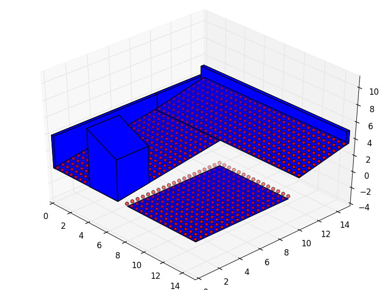
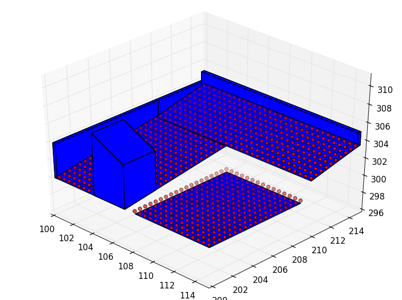
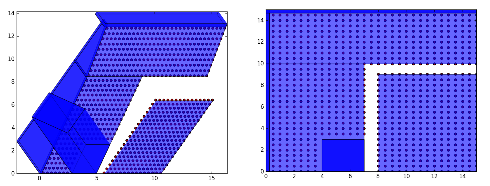

Back to :ref:`tutorials`

.. contents::
    :local:
    
.. _tutorial_space:

Space tutorial
==============
.. figure:: ../images/space.png
   :scale: 70%
   :align: center
   
   *Example of a Space with six individual Places.*
 
.. module:: pyny3d.geoms

.. autoclass:: pyny3d.geoms.Space
   :noindex:

Non-trivial methods
-------------------
As always, you can also use the :ref:`doc_space` documentation for 
method-by-method description, specially for the trivial methods we 
are going to skip in this section.

**Trivial methods:**

    ==========================      ===========================================
          method                                    description  
    ==========================      ===========================================
    .add_places()                   Add new places to the space
    .add_space()                    Merge other spaces with this one
    .add_set_of_points()            Add a set of points
    .clear_set_of_points()          Remove the points in this place
    .explode()                      Collect all the polygons, holes and points 
                                    in the space
    .explode_map()                  Faster version of .explode()
    .get_height()                   Returns the z value for a list of points
    .mesh()                         Generates a list of points homogeneously 
                                    distributed
    .lock()                         Precomputes some values to speedup 
                                    shadowing
    ==========================      ===========================================

The methods to **transform** the classes are explained in detail separately
in :ref:`tutorial_transformations`.

get_map, map2seed, map2pyny
~~~~~~~~~~~~~~~~~~~~~~~~~~~
An Space's map is an array that contains all the points of the Space 
appropriately identified by an index. This way of representing all the 
elements in a Space is very useful to transform it. Indeed, all the 
:ref:`tutorial_transformations` are matrix operations to these maps.

It is important to undertand the index given by the ``.get_map()`` method:

    * The first column is the Place.
    * The second column is the body (-1: points, 0: surface, n: polyhedron)
    * The third column is the polygon (-n: holes)
    * The fourth column is the point.

After modifying a map, we usually want to reconstruct the Space. With this
purpose we have ``.map2seed()`` and ``.map2pyny()`` methods.

Here we have an example where a whole Space is translated:

.. ipython::
    :verbatim:

    In [1]: import numpy as np
       ...: import pyny3d.geoms as pyny
       ...: 
       ...: # Declaring the geometry
       ...: ## Surface
       ...: poly_surf_0 = [np.array([[0,0,0], [7,0,0], [7,10,2], [0,10,2]]),
       ...:                np.array([[0,10,2], [7,10,2], [3,15,3.5]]),
       ...:                np.array([[0,10,2], [3,15,3.5], [0,15,3.5]]),
       ...:                np.array([[7,10,2], [15,10,2], [15,15,3.5], [3,15,3.5]])]
       ...: poly_surf_1 = [np.array([[8,0,0], [15,0,0], [15,9,0], [8,9,0]])]
       ...: 
       ...: ## Obstacles
       ...: wall_1 = np.array([[0,0,4], [0.25,0,4], [0.25,15,4], [0,15,4]])
       ...: wall_2 = np.array([[0,14.7,5], [15,14.7,5], [15,15,5], [0,15,5]])
       ...: chimney = np.array([[4,0,7], [7,0,5], [7,3,5], [4,3,7]])
       ...: 
       ...: # Building the solution
       ...: place_0 = pyny.Place(poly_surf_0, melt=True)
       ...: place_0.add_extruded_obstacles([wall_1, wall_2, chimney])
       ...: place_1 = pyny.Place(poly_surf_1)
       ...: space = pyny.Space([place_0, place_1])
       ...: space.mesh(0.5)
       ...: 
       ...: # Viz
       ...: space.iplot(c_poly='b')    

    
.. ipython::
    :verbatim:

    In [2]: index, map_ = space.get_map()    
    
    In [3]: index  # points reference
    Out[3]: 
    array([[ 0, -1,  0,  0],
           [ 0, -1,  0,  1],
           [ 0, -1,  0,  2],
           ..., 
           [ 1,  0,  0,  1],
           [ 1,  0,  0,  2],
           [ 1,  0,  0,  3]])

    In [4]: map_  # points
    Out[4]: 
    array([[  0.5,   0. ,   0.1],
           [  1. ,   0. ,   0.1],
           [  1.5,   0. ,   0.1],
           ..., 
           [ 15. ,   0. ,   0. ],
           [ 15. ,   9. ,   0. ],
           [  8. ,   9. ,   0. ]])    
    
    In [5]: len(index) # total number of points in the Space
    Out[5]: 940    
    
    In [6]: map_ += (100, 200, 300)  # translation in x, y, and z

    In [7]: map_
    Out[7]: 
    array([[ 100.5,  200. ,  300.1],
           [ 101. ,  200. ,  300.1],
           [ 101.5,  200. ,  300.1],
           ..., 
           [ 115. ,  200. ,  300. ],
           [ 115. ,  209. ,  300. ],
           [ 108. ,  209. ,  300. ]])    
    
    In [8]: space = space.map2pyny(map_)

    In [8]: space.iplot(c_poly='b')

As we have seen, it is very easy to transform a whole space by applying only 
a single matrix operation and reconstructing it later. I encourage you to 
create and share (or suggest) the transformations that you require for your
applications. Due to this package was created with the shadowing simulations
idea in mind, it may lack of elaborated or complex transformations but I 
hope that as more people start using it this problem gets solved.

photo
~~~~~
The photo's documentation is quite extense (maybe too extense) so I refer to it
for the explanation. I am going to extract only this part:

    *In short, this methods answer "How would the Space look in
    a photograph taken from an arbitrary direction in cylindrical 
    perpective?"*
    
That is, what is the vision of the Sun? Let's have a look:

.. ipython::
    :verbatim:

    In [9]: poly_hole_points = space.photo((-np.pi/4, np.pi/4), True)  # Oblique

    In [10]: poly_hole_points = space.photo((0, np.pi/2), True)  # Zenital

|

Next tutorial: :ref:`tutorial_pip_and_classify`

