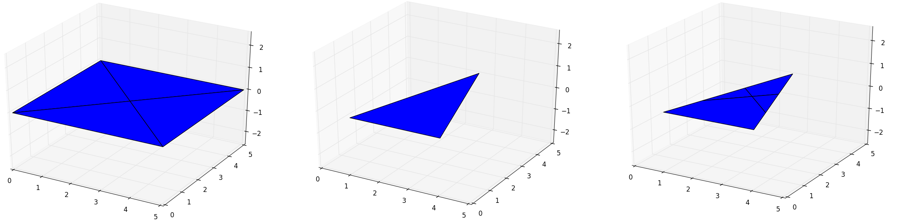
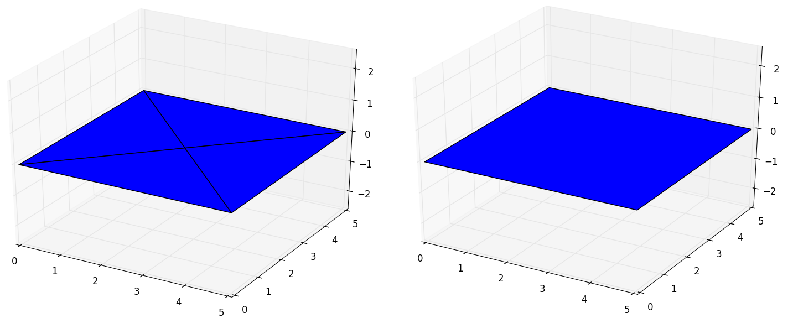

Back to :ref:`tutorials`

.. contents::
    :local:
    
.. _tutorial_surface:

Surface tutorial
================
.. figure:: ../images/surface.png
   :scale: 70%
   :align: center
   
   *Example of a Surface formed by four triangles.*
   
.. module:: pyny3d.geoms

.. autoclass:: pyny3d.geoms.Surface
    :noindex:
    
Non-trivial methods
-------------------
The same that happened with the last tutorial, the non-trivial methods will be 
explained and the trivial ones will be only listed. You can also use the
:ref:`doc_surface` documentation.

**Trivial methods:**

    ==================  =======================================================
          method                       description  
    ==================  =======================================================
    .get_area()         Returns the real area
    .get_height()       Returns the z value for a list of points
    .contiguous()       Returns whether a set of polygons are contiguous
    .add_holes()        Add holes to the surface
    .lock()             Precomputes some values to speedup shadowing
    ==================  =======================================================
    
The methods to **transform** the classes are explained in detail separately
in :ref:`tutorial_transformations`.

The ``.classify()`` method is discussed separately in 
:ref:`tutorial_pip_and_classify`.

intersect_with
~~~~~~~~~~~~~~
Calculates the intersection between the polygons in a surface
and an external polygon in the z=0 projection.

This method fully rely on the ``shapely.Polygon.intersection()``
method. The way this method is used is intersecting this polygon
recursively with all identified polygons which overlaps with it
in the z=0 projection.

The only thing that can be confusing is the output. It is a dictionary in 
which, the different intersections are classified with the index number of the 
Surface's polygon involved.

To illustrate with an example::

    import numpy as np
    import pyny3d.geoms as pyny

    # Geometries (all in z=0)
    surface = pyny.Surface([np.array([[0,0], [5,0], [2.5,2.5]]),
                            np.array([[5,0], [5,5], [2.5,2.5]]),
                            np.array([[5,5], [0,5], [2.5,2.5]]),
                            np.array([[0,5], [0,0], [2.5,2.5]])])
    clip_polygon = pyny.Polygon(np.array([[1, 0], [4, 0], [2.5, 5]]))

    # Intersection
    inter_polys = surface.intersect_with(clip_polygon)

    # Viz
    ## Creating a surface with the intersection polygons
    inter_surf = pyny.Surface([pyny.Polygon(poly) for _, poly in inter_polys.items()])
    surface.plot('b')
    clip_polygon.plot('b')                               
    inter_surf.plot('b')

   *Four coplanar and contiguous polygons, another polygon to clip with and
   the result of clipping*
   
   
contiguous and melt
~~~~~~~~~~~~~~~~~~~
``.contiguous()`` checks whether a set of convex polygons are all contiguous
and coplanar and ``melt()`` computes the union of these polygons if they give
``True`` in the first method. Two polygons are considered contiguous if they 
share, at least, two vertices.

The verification is not a complete one, it is simplified. For a given set of 
polygons this method will chechk if the number of common vertices among them 
equals or exceeds a certain number of common vertices possible. Anyway, this 
little algorithm will never declare a contiguous set of polygons as 
non-contiguous, but it can fail in the reverse for certain geometries where 
polygons have several common vertices among them.

The next example is done for the previous set of polygons:

.. ipython::
    :verbatim:

    In [1]: import numpy as np
       ...: import pyny3d.geoms as pyny
   
    In [2]: surface = pyny.Surface([np.array([[0,0], [5,0], [2.5,2.5]]),
       ...:                         np.array([[5,0], [5,5], [2.5,2.5]]),
       ...:                         np.array([[5,5], [0,5], [2.5,2.5]]),
       ...:                         np.array([[0,5], [0,0], [2.5,2.5]])])
    
    In [3]: surface.plot('b')

    In [4]: pyny.Surface.contiguous(surface.polygons)  # static method
    Out[4]: True
    
    In [5]: surface.melt()
       ...: surface.plot('b')
    

   
   *Union of four coplanar and contiguous polygons*

On the other hand, if the union is non-convex, although the polygons 
individually are, the method will compute the convex union anyway. This will
happen when the number of non-coincident vertices are close to cero. In the 
next examples we are going to see how for one vertex we can make the method
fail but we cannot for two. 

.. ipython::
    :verbatim:

    In [2]: surface = pyny.Surface([np.array([[0,0], [5,0], [2.5,2.5]]),
       ...:                         np.array([[5,0], [5,5], [2.5,2.5]]),
       ...:                         np.array([[5,5], [0,7], [2.5,2.5]]),
       ...:                         np.array([[0,5], [0,0], [2.5,2.5]])])
    
    In [3]: surface.plot('b')

    In [4]: pyny.Surface.contiguous(surface.polygons)
    Out[4]: True
    
    In [5]: surface.melt()
       ...: surface.plot('b')

.. figure:: ../images/tutorials/surface/melt2.png
   :scale: 53%
   :align: center

   *Error at melting non-convex polygons with one non-coincident vertex*
   
When the ``.melt()`` method cannot apply any union it lefts the Surface as it 
is:
   
.. ipython::
    :verbatim:

    In [2]: surface = pyny.Surface([np.array([[0,0], [5,0], [2.5,2.5]]),
       ...:                         np.array([[5,0], [5,7], [2.5,2.5]]),
       ...:                         np.array([[5,5], [0,7], [2.5,2.5]]),
       ...:                         np.array([[0,5], [0,0], [2.5,2.5]])])
    
    In [3]: surface.plot('b')

    In [4]: pyny.Surface.contiguous(surface.polygons)
    Out[4]: False
    
    In [5]: surface.melt()
       ...: surface.plot('b')

.. figure:: ../images/tutorials/surface/melt3.png
   :scale: 53%
   :align: center

   *A Surface with two non-coincident vertices*
   
Does this mean that ``.melt()`` method is unusable? Absolutely not. If the
set of polygons are known to have a convex union the problem will not exist. 
And anyway, the method fails in very specific and known cases so you can 
control when and where use it.
   
|

Next tutorial: :ref:`tutorial_polyhedron`

